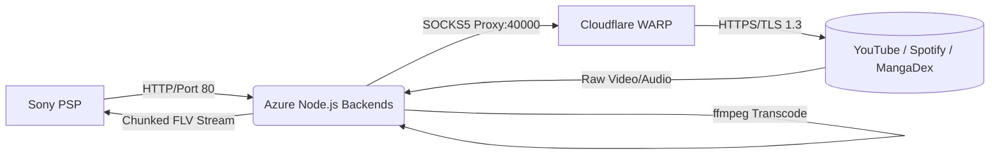

# System Architecture

The PSP Streaming Project allows the original Sony PlayStation Portable (PSP) hardware from 2004 to seamlessly interact with modern web APIs, streaming platforms (YouTube, Spotify, SoundCloud), and cloud storage.

This document details the architectural decisions and internal routing required to bridge modern TLS 1.3/HTTPS web services down to the PSP's TLS 1.0 and limited memory constraints.

## High-Level Pipeline

The ecosystem revolves around a **Proxy Backend** pattern. The PSP never directly contacts modern servers; it strictly communicates via HTTP (port 80) to a Node.js server (hosted on Azure), which acts as a heavy-lifting middleman.

## Component Architecture

### 1. The Frontend (PSP Hardware)
The PSP utilizes a proprietary web browser (NetFront) with maximum memory limits of around 2MB for web pages. 
- **Video Playback**: The PSP utilizes a hardware-accelerated video decoder for H.264 MP4s and Sorenson Spark FLV. Due to strict constraints on H.264 profiles, FLV is the most resilient container for live streaming to the PSP.
- **Connection Mechanics**: The PSP streams video using standard HTTP GET requests. However, it aggressively uses HTTP Keep-Alive. If Keep-Alive is permitted on the server, the PSP will reuse the TCP socket to request new video ranges.

### 2. The Backend Servers (Node.js)
The ecosystem is split into several micro-services managed by PM2:
- `yt2009/backend.js`: Serves the 2009-era YouTube HTML interface and handles video search/metadata via Android API tokens.
- `backend.js`: The heavy-lifting streaming server that intercepts `/stream_flv` requests, downloads raw video via `yt-dlp`, transcodes to FLV via `ffmpeg`, and pipes it back to the PSP.
- `spotiflac-server_azure.js`: Handles Spotify/SoundCloud searches and audio-only FLV streaming.
- `manga-server.js`: Converts massive MangaDex images into 480x272 sliced JPEGs for the PSP's Lua interpreter.

### 3. The Proxy Layer (Cloudflare WARP)
A significant architectural challenge in this project was YouTube's "BotGuard" and Datacenter IP blocking. When `yt-dlp` attempts to fetch a video signature from an Azure IP, YouTube responds with `403 Forbidden` or "Sign in to confirm you're not a bot".

**The Solution:**
We deployed `cloudflare-warp` on the Azure VM, bound to `127.0.0.1:40000` as a local SOCKS5 proxy. All `yt-dlp` traffic is routed through this proxy using `--proxy socks5://127.0.0.1:40000`. This completely masks the Azure Datacenter IP behind a clean, residential-grade Cloudflare IP, completely bypassing the blocks.

### 4. The Transcoding Engine (FFmpeg)
Modern streaming formats (WebM, VP9, AV1) are fundamentally incompatible with the PSP. 
The backend dynamically spawns `ffmpeg` processes to transcode video and audio in real-time.

**Critical Architectural Rules for FFmpeg:**
1. **Never use `-re` for VOD Streaming**: The `-re` flag throttles ffmpeg to real-time. This starves the PSP's internal memory buffer (the "light blue line"), causing massive stuttering. Unthrottled transcoding is mandatory for smooth PSP playback.
2. **Never pipe MP4s directly into FFmpeg**: Piping `yt-dlp` stdout directly into `ffmpeg stdin` (`pipe:0`) for YouTube MP4s causes `ffmpeg` to hang indefinitely. This is because MP4 moov atoms are at the end of the file, and `ffmpeg` cannot seek through a pipe. 
   - *Fix:* Use `yt-dlp -g` to extract the direct HTTP URL, and pass that URL into `ffmpeg -i <URL>`. FFmpeg handles HTTP range requests natively to read the moov atom instantly.

## Memory & Process Management
Because the server spawns heavy `ffmpeg` instances for every stream, it implements aggressive garbage collection and crash protection:
- `uncaughtException` and `unhandledRejection` globals prevent the main thread from dying.
- `req.on('close')` explicitly fires `ffmpeg.kill('SIGKILL')`.
- `Connection: close` headers force the PSP to drop sockets between requests, preventing stream bleeding (where old ffmpeg processes leak data into new video streams).
- `activeTranscodes` sets limit concurrent streams and automatically flush ghost processes after 30 minutes.
