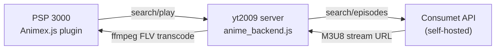

# 🎌 Anime Streaming on PSP 3000 via GoTube

Stream anime episodes directly on the PSP 3000 using the same FLV pipeline that already works for YouTube.

## How It Works (Architecture)



The PSP gets a **new GoTube plugin** (`Animex.js`) that appears as a separate "site" in GoTube's site selector. When you search, it hits the yt2009 server which queries a self-hosted Consumet API for anime, then transcodes episodes to FLV using the exact same ffmpeg settings that work for YouTube.

---

## Proposed Changes

### Consumet API (Self-Hosted Backend)

We clone and run the Consumet API locally alongside the yt2009 server. This gives us REST endpoints for:
- `GET /anime/gogoanime/search?q=naruto` → search results
- `GET /anime/gogoanime/info?id=naruto` → episode list
- `GET /anime/gogoanime/watch?episodeId=naruto-episode-1` → streaming URLs (M3U8/MP4)

#### [NEW] Self-hosted Consumet instance
- Clone `consumet/api.consumet.org` to `C:\consumet`
- `npm install` and run on port `3001`
- Runs alongside yt2009 on the same laptop

---

### yt2009 Server (Anime Routes)

Add new Express routes to the existing yt2009 `backend.js` that translate between GoTube's expected XML format and Consumet's JSON API.

#### [NEW] `C:\yt2009\back\anime_backend.js`

A new Node.js module with three functions:

1. **`anime_search(query, callback)`** — Calls Consumet search, returns results as GData XML (the exact format GoTube's `ext()` parser expects):
```xml
<?xml version="1.0" encoding="utf-8"?>
<feed>
  <openSearch:totalResults>20</openSearch:totalResults>
  <entry>
    <id>http://IP:8081/anime/api/videos/naruto</id>
    <title type='text'>Naruto</title>
    <content type='text'>Action, Adventure</content>
    <media:group>
      <yt:duration seconds='1440'/>
      <media:thumbnail url='https://gogocdn.net/cover/naruto.png'/>
    </media:group>
  </entry>
</feed>
```

2. **`anime_episodes(animeId, callback)`** — Returns episode list in the same XML format, where each `<entry>` is an episode.

3. **`anime_stream(episodeId, res)`** — Fetches the M3U8/MP4 URL from Consumet, downloads via ffmpeg, converts to FLV with the working settings:
```
-vcodec flv1 -b:v 600k -s 480x272 -r 24 -acodec libmp3lame -ar 44100 -ac 2 -ab 96k
```
Then redirects the PSP to the cached FLV file (same `res.redirect` pattern as YouTube).

#### [MODIFY] `C:\yt2009\back\backend.js`

Add three new Express routes:
```javascript
// Anime search (returns GData XML)
app.get("/anime/api/videos", (req, res) => { ... })

// Anime episode list (returns GData XML)
app.get("/anime/episodes", (req, res) => { ... })

// Anime stream (downloads + transcodes + serves FLV)
app.get("/anime/play", (req, res) => { ... })

// Anime thumbnail proxy
app.get("/anime/thumb/*", (req, res) => { ... })
```

---

### PSP GoTube Plugin

#### [NEW] `E:\PSP\GAME\GoTube\site\Animex.js`

A new GoTube site plugin (identical structure to `YouTubex.js`) that:
- Shows up as **"Animex"** in GoTube's site picker
- Search queries hit `/anime/api/videos?q=...` (returns anime titles)
- When you click an anime, it fetches `/anime/episodes?id=...` (shows episodes as a list)
- When you click an episode, it calls `Animex.play(episodeId)` → `/anime/play?id=...`

**User flow on PSP:**
1. Switch to "Animex" site in GoTube
2. Search "naruto"
3. See list of anime results
4. Click "Naruto" → see episode list (Ep 1, Ep 2, ...)
5. Click episode → streams in FLV

> [!IMPORTANT]
> **Two-level browsing limitation:** GoTube only has one "search results" view. To show episodes after selecting an anime, we have two options:
> - **Option A:** Prefix search with anime name to get episodes directly (e.g., search "naruto 5" for episode 5)
> - **Option B:** The first click on an anime title triggers a new search that returns episodes as results
> 
> **Option B is recommended** — clicking an anime triggers `Animex.play(id)` which actually does a second `GetContents()` call to fetch the episode list, then auto-plays episode 1. To pick a specific episode, you search "$ep5 naruto" (reusing the category prefix feature from YouTubex).

---

### Anime Thumbnail Proxy

Since anime thumbnails come from external CDNs (gogocdn.net, etc.), the PSP can't load them directly (HTTPS, CORS). The yt2009 server will proxy thumbnails:
- `GET /anime/thumb/naruto.png` → fetches from gogocdn, pipes back as HTTP

---

## Open Questions

> [!IMPORTANT]
> **Episode selection UX:** GoTube's UI is a flat list of search results. How do you want to pick episodes?
> - **Option A:** Search "naruto 5" to directly play episode 5
> - **Option B:** Click anime title → shows episode list as new results → click episode to play
> - **Option C:** Just always auto-play episode 1, and search "naruto 12" for specific episodes

> [!IMPORTANT]  
> **Provider choice:** Consumet supports multiple anime providers (Gogoanime, Zoro/AniWatch, AnimePahe). These change frequently. Which one do you prefer, or should I set up with fallback support?

> [!NOTE]
> **First-play timeout:** Same 10-second GoTube timeout applies. First click on an episode will timeout while downloading/converting. Second click plays instantly from cache. This is identical to the YouTube behavior you're already used to.

---

## Verification Plan

### Automated Tests
1. Start Consumet API on port 3001, verify `curl http://localhost:3001/anime/gogoanime/search?q=naruto` returns JSON
2. Start yt2009 server, verify `curl http://172.20.10.2:8081/anime/api/videos?q=naruto` returns valid GData XML
3. Verify ffmpeg transcodes an anime episode M3U8 stream to FLV successfully
4. Check FLV file plays correctly in VLC

### Manual Verification
1. Plug in PSP, copy `Animex.js` to GoTube site folder
2. Open GoTube, switch to "Animex" site
3. Search for an anime, verify results appear
4. Click an episode, verify it streams and plays
